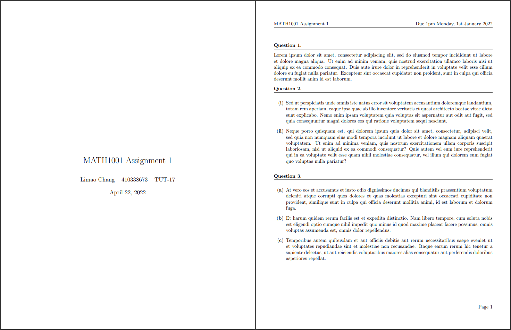

---

<h3 align="center">Assignment Texplate</h3>

This is a LaTeX template that you can use for your math assignments and homework. It provides a cleanly formatted document layout, simple commands to add new questions and subquestions, and some miscellaneous macros to improve your efficiency.

<details open="open">
    <summary>Table of Contents</summary>
    <ol>
        <li>
            <a href="#installation">Installation</a>
        </li>
        <li>
            <a href="#usage">Usage</a>
        </li>
        <li>
            <a href="#license">License</a>
        </li>
    </ol>
</details>

## Installation

First fork this repository and clone it to some local folder on your computer:

```
git clone https://github.com/your-username/assignment-texplate
```

Then all you need to do is to copy the `style.sty` file to wherever you need it. To use the package in a `.tex` file, just add the following command to the preamble (before the document starts):
```tex
\usepackage{style}
```

There may occasionally be updates to the template (this will most likely just be me wanting to add some more macros). To receive these updates, just run the command below:

```
git pull
```

## Usage

The `template.tex` file should get you started - it provides some examples of how to use the helper commands. Alternatively, if you'd prefer a fresh copy, the `empty.tex` file provides the barebones setup needed to use the template.

The main features of the template are listed below.

### Questions
`\question` inserts a new question, which starts at 1. To start at a different number, add this line in, replacing `<questionNumber>` with the question number you want to start at.

```tex
\setcounter{questionCounter}{<questionNumber> - 1}
```

### Subquestions

For questions with multiple parts, you can use the `subquestions` environment like so:

```tex
\begin{subquestions}
    \subquestionroman
        This creates subquestion part (i).
    \subquestionroman
        This creates subquestion part (ii).
    \subquestionroman
        This creates subquestion part (iii).
\end{subquestions}
```

You can also use `\subquestionalph` for alphabetical parts, i.e. `(a), (b), (c)`, or `\subquestionnum` for numerical parts, i.e. `(1), (2), (3)`. This can be changed in `style.sty`, or you can add your own too.

### Miscellaneous macros

There are some defined macros for common symbols to make them easier to type out. You can view the exhaustive list in `style.sty`, but here are a few examples:

- Number sets
  - `\R` for the set of real numbers, $\mathbb{R}$
  - `\N` for the set of natural numbers, $\mathbb{N}$
  - etc.
- Probability
  - `\E{X}` for the (properly formatted) expectation of `X`, $\mathbb{E}(X)$
  - `\Var{X}` for the (properly formatted) variance of `X`, $\mathbb{V}\text{ar}(X)$
  - etc.
- Auto-sized brackets
  - `\br{x}` for automatically-sized round brackets
  - `\sqbr{x}` for automatically-sized square brackets
  - etc.

These custom macros also support subscript and superscripts; e.g. `\E{x}_\theta` yields $\mathbb{E}_\theta(X)$, and `\Var{X}^2` yields $\mathbb{V}\text{ar}^2(X)$.

There are also some useful packages that have been included in `style.sty` (which you can also add to). For example, the `physics` package provides `\dd` or `\dd{x}` for differentials, `\dv{x}` for ordinary derivatives, `\pdv{x}` for partial derivatives, etc.

## License
(MIT License) See [LICENSE](https://github.com/LimaoC/assignment-texplate/blob/main/LICENSE).
