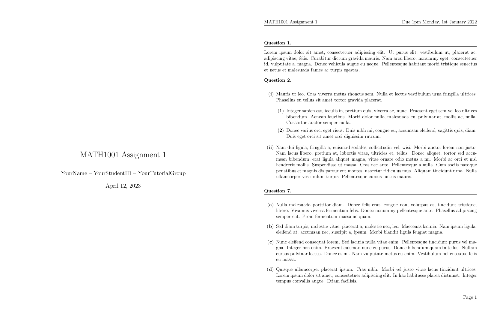

---

<h3 align="center">Limao's TeXplates</h3>

This repo is a collection of my custom LaTeX templates and packages.

- [assignment-texplate](/assignment-texplate/): A package and template you can use for your assignment and homework. It provides a nicely formatted document layout and simple commands to format question numbers and headings.
- [cheatsheet-texplate](/cheatsheet-texplate/): A template you can use for creating your cheatsheets.

Aside: If you're interested in using TeX snippets, mine can be found [here](https://github.com/LimaoC/dotfiles/blob/main/.config/nvim/UltiSnips/tex.snippets).

## Usage

See the `README.md`'s in each respective directory.

## License
(MIT License) See [LICENSE](https://github.com/LimaoC/assignment-texplate/blob/main/LICENSE).

