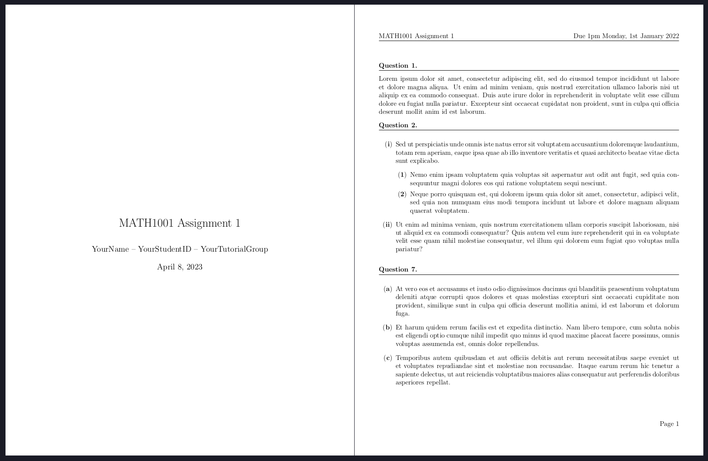
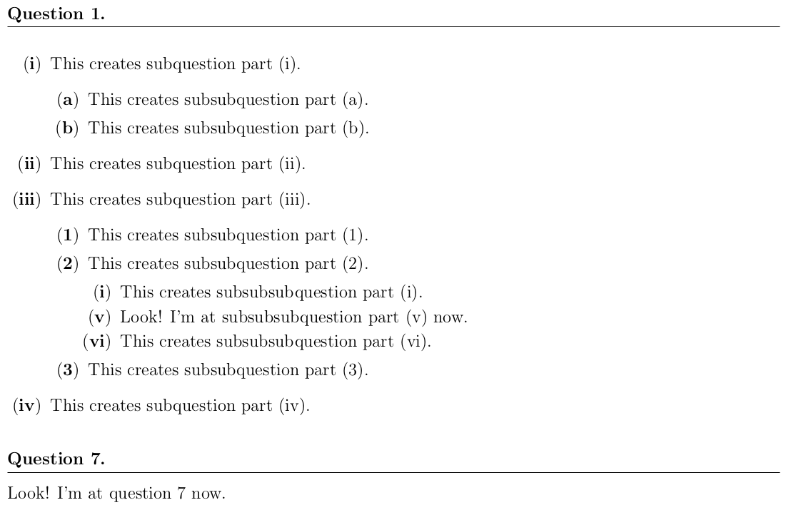

---

<h3 align="center">Limao's TeXplates</h3>

This repo is a collection of the LaTeX templates that I use.

- Under `assignment/` is a template you can use for your assignment and homework. It provides a nicely formatted document layout and simple commands to format question numbers and headings.

Note: I don't really use any LaTeX-defined macros. I use snippets instead, which you can find [here](https://github.com/LimaoC/dotfiles/blob/main/.config/nvim/UltiSnips/tex.snippets).

## Usage

To use these template files, you can clone this repository and copy the template files over for each LaTeX project you have. If you want to receive updates when I make changes, you'll want to `git pull` the repository from time to time.

### Assignment Template

Copy over the `assignment-texplate.sty` file to the directory where your LaTeX project is, and add `\usepackage{assignment-texplate}` to the preamble. You can change your details (the details that appear on the title page) in the `assignment-texplate.sty` file.

See the `assignment-example.tex` file for an example usage of the template.

If you like, you can also choose to start from the `assignment-empty.tex` file.

#### Questions
`\question` inserts a new question (starting from 1). To start at or skip to a different number, use

```tex
\questiongoto{<number>}
```

to set the next `\question` to start from `<number>`.

#### Subquestions

For questions with multiple parts, you can use the `squestions`, `ssquestions`, and `sssquestions` environments. Each environment has their own set of item types;

- `\squestionalph`, `\ssquestionalph`, `\sssquestionalph` for alphabetical enumerating
- `\squestionnum`, `\ssquestionnum`, `\sssquestionnum` for numerical enumerating
- `\squestionroman`, `\ssquestionroman`, `\sssquestionroman` for roman numeral enumerating

Example usage:

```tex
\question
\begin{squestions}
    \squestionroman
    This creates subquestion part (i).
    \begin{ssquestions}
        \ssquestionalph
        This creates subsubquestion part (a).

        \ssquestionalph
        This creates subsubquestion part (b).
    \end{ssquestions}

    \squestionroman
    This creates subquestion part (ii).

    \squestionroman
    This creates subquestion part (iii).
    \begin{ssquestions}
        \ssquestionnum
        This creates subsubquestion part (1).

        \ssquestionnum
        This creates subsubquestion part (2).
        \begin{sssquestions}
            \sssquestionroman
            This creates subsubsubquestion part (i).

            \sssquestiongoto{5}
            \sssquestionroman
            Look! I'm at subsubsubquestion part (v) now.

            \sssquestionroman
            This creates subsubsubquestion part (vi).
        \end{sssquestions}

        \ssquestionnum
        This creates subsubquestion part (3).
    \end{ssquestions}

    \squestionroman
    This creates subquestion part (iv).
\end{squestions}

\questiongoto{7}
\question
Look! I'm at question 7 now.
```



## License
(MIT License) See [LICENSE](https://github.com/LimaoC/assignment-texplate/blob/main/LICENSE).
