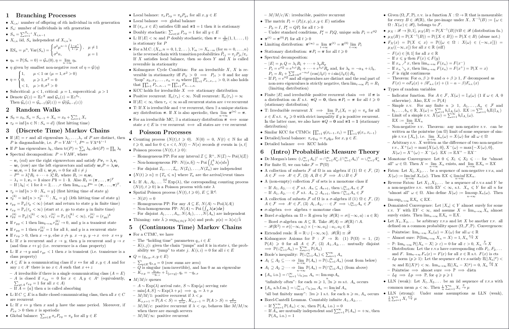

# Cheatsheet TeXplate



## Usage

**NOTE: Make sure you've followed the installation instructions in the repo's main README.md ([here](../README.md)).**

A `preamble.tex` file is provided (which builds ontop of `limao-preamble`) where you can change the details that appear on the title page.

You can start fresh with `empty.tex` (which imports the `preamble.tex` file). If you'd prefer not to have a title page, comment out these lines in `empty.tex`:

```tex
\begin{titlingpage}
    \maketitle
\end{titlingpage}
```

There is a template preamble file `preamble.tex` that you can use to start from. It contains all the page formatting options and included packages etc. Feel free to change these. You can start fresh with `empty.tex` (which imports the `preamble.tex` file).

See the `example.tex` file for an example usage of the template. If you'd prefer not to have a title page, comment out these lines in your `.tex` file:

```tex
\begin{titlingpage}
    \maketitle
\end{titlingpage}
```
